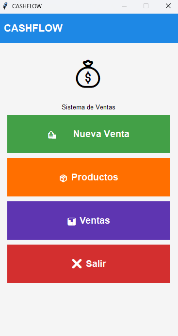
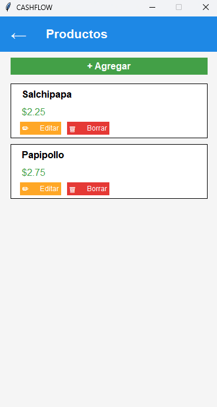
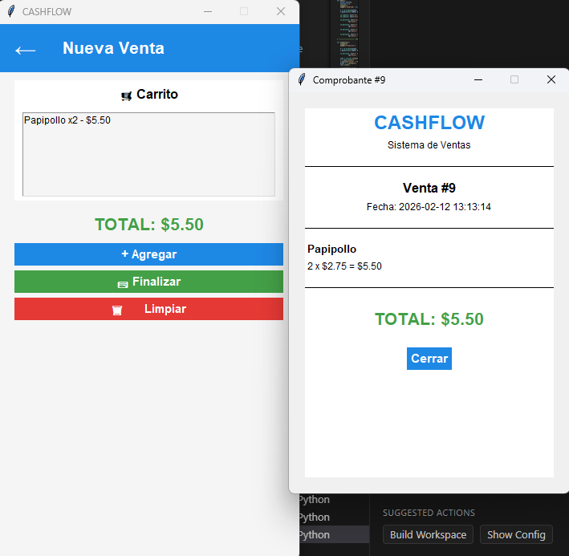
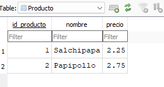
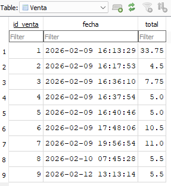
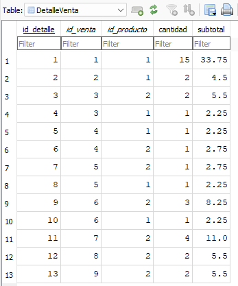

# CashFlow

Sistema de facturación y gestión de ventas desarrollado en Python utilizando Tkinter y SQLite.

---

## Descripción

CashFlow es una aplicación de escritorio que permite registrar productos, crear ventas, calcular totales automáticamente y generar comprobantes simples.  
Toda la información se almacena en una base de datos SQLite, permitiendo mantener un control organizado y persistente de las ventas realizadas.

Proyecto académico desarrollado en la asignatura de Programación Estructurada y Funcional.

Repositorio:
https://github.com/josealejandro-hub/Articulo_Individual_CashFlow.git

---

## Objetivo

Desarrollar una aplicación que permita gestionar ventas de manera organizada, reduciendo errores en cálculos manuales y facilitando el control de ingresos.

---

## Tecnologías utilizadas

- Python 3  
- Tkinter  
- ttk (tkinter.ttk)  
- sqlite3  
- datetime  
- Visual Studio Code  
- DB Browser for SQLite  

---

## Base de datos

El sistema utiliza una base de datos llamada:

cashflow.db

Contiene las siguientes tablas:

### Producto

- id_producto  
- nombre  
- precio  

### Venta

- id_venta  
- fecha  
- total  

### DetalleVenta

- id_detalle  
- id_venta  
- id_producto  
- cantidad  
- subtotal  

---

## Funcionalidades principales

- Registro de productos  
- Edición de productos  
- Eliminación de productos  
- Creación de nuevas ventas  
- Gestión de carrito de compras  
- Cálculo automático de subtotales y total  
- Generación de comprobante  
- Consulta de ventas registradas  

---

## Capturas del sistema

### Interfaz principal

### Gestión de productos

### Nueva venta

---

## Estructura de las tablas en SQLite

### Tabla Producto

### Tabla Venta

### Tabla DetalleVenta

---

## Estructura del proyecto

Articulo_Individual_CashFlow/  
│  
├── facturas-basicas/  
│   ├── cashflow.py  
│   └── cashflow.db  
│  
├── assets/  
│   ├── menu.png  
│   ├── productos.png  
│   ├── nueva_venta.png  
│   ├── tabla_producto.png  
│   ├── tabla_venta.png  
│   └── tabla_detalleventa.png  
│  
└── README.md  

---

## Instrucciones de ejecución

1. Clonar el repositorio:

git clone https://github.com/josealejandro-hub/Articulo_Individual_CashFlow.git

2. Ingresar a la carpeta del proyecto:

cd Articulo_Individual_CashFlow

3. Ingresar a la carpeta del sistema:

cd facturas-basicas

4. Ejecutar el sistema:

python cashflow.py

---

## Autor

José Alejandro Calle Saltos  
Ingeniería en Tecnología de la Información  
Pontificia Universidad Católica del Ecuador – Sede Esmeraldas
